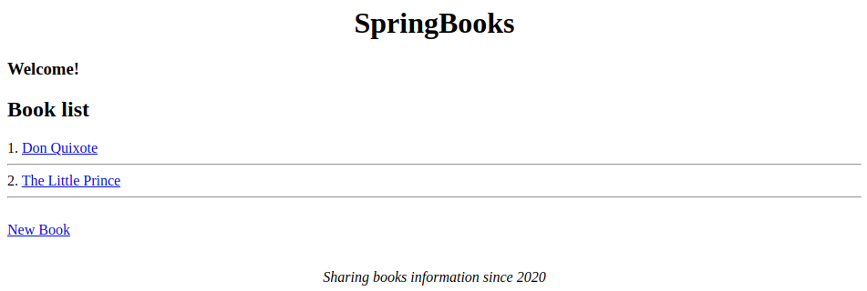

# Springbooks

This is a Java 11 project that exposes a REST API documented with OpenAPI and a basic web frontend using Mustache templates, developed with SpringBoot 2.4.0 with customizable data loading on startup. All the information is stored in memory, any persisntency is implemented. 

It implements the following [scenario](doc/scenario.md). It has been developed using [Spring Tool Suite 4](https://spring.io/tools)

## 1. Deployment

Once that the repository has been cloned:

```
$ git clone https://github.com/david-rojo/cloudApps-spring-books.git
```

import the project in your IDE and to execute it, right click of the mouse in **springbooks** folder in Package Explorer window and select *Run as > Spring Boot App*

You can access to its exposed frontend here: [http://localhost:8080/](http://localhost:8080/)



and also, as requested, to its REST API: [http://localhost:8080/springbooks-manager-api.html](http://localhost:8080/springbooks-manager-api.html)


## 2. Initial data loading on startup (Additional work)

Going beyond the scenario requested, an initial data loading of some data has been implemented, specifically two books with one comment associated to each book.

The default value is false, but if is needed to enable it, you have to set ```springbooks.config.startup.dataload``` property to ```true``` in [springbooks.properties](springbooks/src/main/resources/springbooks.properties) file

## 3. Testing the scenario

Once the project is deployed, it is ready to verify that implements the requested scenario. 

### 3.1. Web

Connect to exposed frontend [http://localhost:8080/](http://localhost:8080/) and try to perform the requested operations:

* The webpage will be able to manage many books.
* In the main page will appear the book titles.
* Every book title will be a link that when it will be clicked, a webpage will be open where it will be shown the book content (title, summary, author, publisher and publication year).
* In the main page will be a link that when it will be clicked, a webpage to create a new book will be shown.
* Every book could have comments associated that they will be shown below of its content with a score between 0 and 5.
* In order to be able to create a comment, below of the book content will be shown a form to fill user, comment and score.
* When a user has previously created a comment and is going to create another one, its name will appear preloaded in the form.
* Every comment will be shown with a delete button that will allow to delete it.
* There is not any type of access control. Anyone could create new books or comments. Anyone could delete any comment.

### 3.2. REST API

The following operations has been implemented as requested:

| DESCRIPTION                                                                                      | PATH                                                          |
|--------------------------------------------------------------------------------------------------|---------------------------------------------------------------|
| Retrieve a list with the id and the title of each book (but not the other attributes of a book). | ```GET /springbooks/books```                                  |
| Retrieve the information from a book (comments included).                                        | ```GET /springbooks/books/{bookId}```                         |
| Create a book.                                                                                   | ```POST /springbooks/books```                                 |
| Create a comment associated to a book.                                                           | ```POST /springbooks/books/{bookId}/comments```               |
| Delete a comment.                                                                                | ```DELETE /springbooks/books/{bookId}/comments/{commentId}``` |
| **Additional work**: retrieve the comments of a book.                                            | ```GET /springbooks/books/{bookId}/comments```                |

Two ways are provided to test these operations:

* Automatically generated OpenAPI webpage: [http://localhost:8080/springbooks-manager-api.html](http://localhost:8080/springbooks-manager-api.html)
* Using the prepared [Postman](https://www.postman.com/) collection attached in the current repository: [springbooks.postman_collection.json](postman/springbooks.postman_collection.json). It contains all needed data to test each endpoint immediately.

## Author

[David Rojo(@david-rojo)](https://github.com/david-rojo)