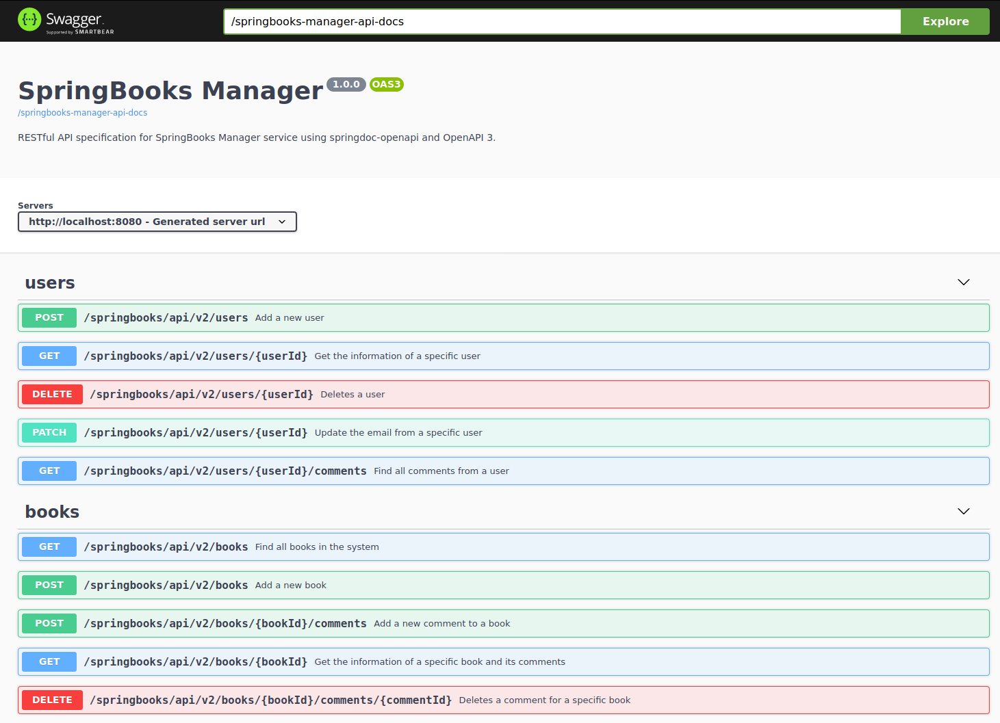

# Springbooks

## 1. Installing the project

```
mvn clean install
```

## 2. Deployment

Before deploy the application, is needed to has a available MySQL database, the most easy way is with docker executing the following command:

```
docker run --rm -e MYSQL_ROOT_PASSWORD=password -e MYSQL_DATABASE=posts -p 3306:3306 -d mysql:8.0.22
```

Also is required to create the ```books``` schema in MySQL database, this action can be performed using MySQL Workbech.

Once we have it ready, we launch the application:

```
mvn spring-boot:run
```

### 3. OpenApi GUI:

[http://localhost:8080/springbooks-manager-api.html](http://localhost:8080/springbooks-manager-api.html)


