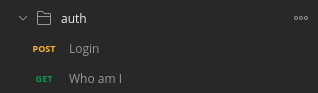
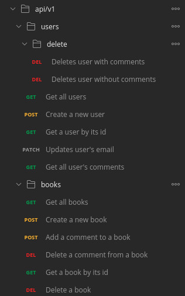

# Springbooks

This is a Java 11 project that exposes a REST API, developed with [SpringBoot](https://spring.io/projects/spring-boot) 2.4.0 implementing Spring Authentication and Auhorization using [JWT](https://www.jwt.io/). All the information is stored in a [MySQL](https://www.mysql.com/) database.

It implements the following [scenario](doc/scenario.md). It has been developed using [Spring Tool Suite 4](https://spring.io/tools) as IDE.

## Deploying infrastructure

Is needed to run the application the deployment of MySQL instance:

```
$ docker-compose up
```

If you wish to launch the containers in background, include ```-d```

The running database has these connection details:

  * port: ```3306```
  * user: ```root```
  * password: ```password```
  * database: ```books```
  
## Deploying the application

```
mvn spring-boot:run
```

When the application is deployed the following data are loaded in tables of ```books``` database:

### books

| id | author        | publication_year | publisher        | summary        | title        |
|----|---------------|------------------|------------------|----------------|--------------|
| 1  | Book 1 author | 1999             | Book 1 publisher | Book 1 summary | Book 1 title |
| 2  | Book 2 author | 2012             | Book 2 publisher | Book 2 summary | Book 2 title |

### comments

| id | comment        | score | book_id | user_id |
|----|----------------|-------|---------|---------|
| 1  | Book 2 comment | 3     | 2       | 1       |
| 2  | Book 2 comment | 4     | 2       | 1       |

### users

Both users has the same password: ```password``` but appears encoded, as it is stored in this way in order for security purpose.

| id | email          | password                                                     | username |
|----|----------------|--------------------------------------------------------------|----------|
| 1  | user1@email.es | $2a$10$XURPShQNCsLjp1ESc2laoObo9QZDhxz73hJPaEv7/cBha4pk0AgP. | user1    |
| 2  | user2@email.es | $2a$10$XURPShQNCsLjp1ESc2laoObo9QZDhxz73hJPaEv7/cBha4pk0AgP. | user2    |


**Also when the application is stopped**, the information loaded is deleted in the database providing a clean scenario everytime the application is launched.

## Testing the application

A [Postman](https://www.postman.com/) collection is provided in the current repository [Practice4-security.postman_collection.json](Practice4-security.postman_collection.json) to easily play and test the application.

It contains all needed data to test each endpoint immediately but you have to define these environment variables:

| NAME     | VALUE                                                    |
|----------|----------------------------------------------------------|
| baseUrl  | https://localhost:8443                                   |
| jwtToken | execute Login request in auth folder to retrieve a token |

The ```jwtToken``` value has been used in **Authorization** header, that you can find in Headers tab of Postman

The collection contains three main folders:

### anonymous

Exposes the operations that the not registered users can execute: create a user and get the books of the system with some information.


### auth

Exposes the login endpoint needed to get a JWT in order to  be able to execute the requests of **api/v1** folder and also the Who am I request that query the ```/me``` endpoint that receives a token in headers and returns the username of the query.



### api/v1



## Author

[David Rojo(@david-rojo)](https://github.com/david-rojo)
